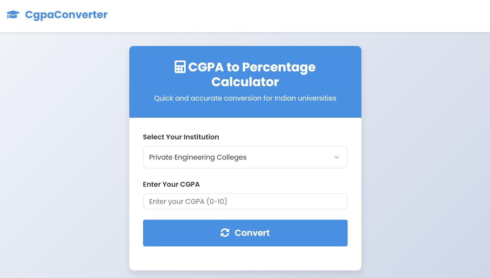

# CGPAConverter – SaaS Web Tool  
🔗 [Live Demo](https://sachinbhanu7.github.io/CgpaConverter/) | 📁 [GitHub Repository](https://github.com/sachinbhanu7/CgpaConverter)

A simple and responsive SaaS-style web tool that converts CGPA to percentage based on Mumbai University and private university formulas.

---

## 🚀 Features

- Supports CGPA to percentage conversion for Mumbai University and other private universities  
- Instant result calculation on user input  
- Clean and responsive user interface  
- No backend or login required — just open and use

---

## 🛠️ Technology Stack

- HTML5  
- CSS3  
- JavaScript (Vanilla)

---

## 📁 Project Structure

cgpa-converter/
├── index.html ⟶ Main UI for input & output
├── script.js ⟶ Handles logic for conversion
├── style.css ⟶ Styling and layout
├── preview.png ⟶ Screenshot of the website
├── sitemap.xml ⟶ SEO sitemap
├── robots.txt ⟶ SEO configuration
└── README.md ⟶ Project overview

---

## 🧠 How to Use

1. Visit the [Live Demo](https://sachinbhanu7.github.io/CgpaConverter/)  
2. Select your university type  
3. Enter your CGPA  
4. Get your percentage instantly!

---

## 📜 License

This project is open source and available under the [MIT License](LICENSE).

